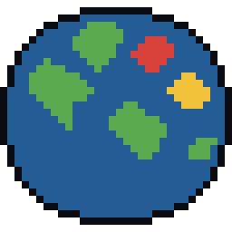

# Pixel Conquest 2.0

Стратегия о захвате мира в реальном времени для ПК. Территория не делится на провинции заранее: страна растёт клетка за клеткой, а фронт двигается туда, куда вы направили армию. Можно играть офлайн против ботов и по сети с друзьями через **Steam** или по **локальной сети / IP**.



## Что нового в 2.0

- **Захват по клеткам.** Карта мира — 2000×800 клеток, остальные карты — 1400×800. Граница страны плавная, атаки идут широким фронтом, окружённые анклавы переходят к соседу.
- **Новый рендер.** Гладкий рельеф с тенями, глубина воды, полупрозрачные территории с чёткой границей, плавный зум от всего мира до отдельных зданий, подписи стран, взрывы и ядерные грибы.
- **Свободная постройка.** Любое здание ставится в любую свою клетку суши (порт — на морском берегу). Здания улучшаются и сносятся.
- **Флот, торговля, удары, дипломатия, исследования** — подробно ниже.
- **Новый интерфейс** на шрифте Inter: верхняя панель со статистикой и целями победы, док с инструментами, подсказки у курсора, контекстное меню, окно «Страны».
- **Lockstep-мультиплеер до 12 игроков** через Steam или LAN, с ботами и автоматической пересинхронизацией.

## Карты

- **Земля** — реальные очертания суши по Natural Earth (1:10 млн), видны даже мелкие острова: Карибы, Океания, Курилы, Канары, Мальдивы, Гавайи. Сахара, Аравия и Австралия — пустыни, Сибирь и Канада — тайга, Гималаи, Анды и Скалистые горы — горы.
- **Архипелаг, Пангея, Два континента, Внутреннее море** и **Случайная** — процедурные карты, каждая партия по своему seed.
- **Великий Крест** и **Шахматные острова** — пользовательские карты из папки `maps/`. Можно загрузить и свою (см. ниже).

Рельеф влияет на бой: горы, холмы и леса дороже захватывать и легче оборонять, пустыня — наоборот.

## Цели победы

Перед началом партии можно включить одну или обе цели:

- **Захват территории** — владеть заданной долей всей суши (от 30 до 100%, по умолчанию 70%).
- **Экономическое лидерство** — держать самый большой чистый доход с отрывом не меньше 15% от второго места непрерывно заданное время (от 5 до 60 минут).
- **Последний выживший** действует всегда: побеждает последняя оставшаяся страна или союзная коалиция (тогда победитель — её лидер по территории).

## Как играть

- **Старт.** Первые 15 секунд — выбор места: щёлкните по свободной суше. Боты выбирают место сами, а если вы не успеете, место выберется случайно.
- **Атака.** Щёлкните ЛКМ по ничьей или вражеской земле рядом с вашей границей. Уйдёт столько войск, сколько задано ползунком «Сила атаки» внизу экрана. Пока атака идёт, войска тратятся на каждую захваченную клетку.
- **Высадка.** Если цель не граничит с вами по суше, но до неё можно доплыть, тот же щелчок отправит десант на транспорте. Одновременно в море может быть до 3 транспортов. Режим высадки включается и вручную клавишей `B`.
- **Армия** растёт сама до максимума, который зависит от размера страны и жилых кварталов. Состав армии тоже определяется сам: изучили бронетехнику — в армии появились танки, артиллерию — появилась артиллерия (нужна хотя бы одна фабрика).
- **Экономика.** Золото приносят территория, население, дома, фабрики и торговля. ПВО, шахты, аэродромы и военные корабли требуют содержания. Если казна уходит в минус, войска начинают дезертировать.

### Постройки

| Клавиша | Здание | Что даёт |
|---|---|---|
| `1` | Жилой квартал | +25 000 к максимуму войск и +6 золота/с за уровень |
| `2` | Фабрика | возит грузы в ближайший свой порт; без порта даёт золото напрямую; открывает танки и артиллерию |
| `3` | Порт | верфь, торговые суда, приём грузов; только на морском берегу |
| `4` | Укрепление | оборона ×1,6 в радиусе 18 клеток |
| `5` | ПВО | сбивает дроны, ракеты и бомбы в своём радиусе |
| `6` | Аэродром БПЛА | запуск дронов (нужно исследование «БПЛА») |
| `7` | Ракетная шахта | запуск ракет и бомб (нужно исследование «Ракеты») |
| `8` | Железная дорога | соединяет фабрики, порты и жилые кварталы; поезд везёт груз вдвое быстрее грузовика |

Каждое следующее здание одного типа дороже предыдущего. Здания ставятся не ближе 5 клеток друг к другу. Щёлкните по своему зданию, чтобы открыть панель: улучшить, снести (вернётся 25% цены), проложить ж/д, построить корабль или нанести удар.

### Флот и торговля

- **Торговые суда** порты отправляют сами — в порты других стран на общем море. Доход получают обе стороны, торговый договор добавляет +50%, склад порта (грузы с фабрик) тоже увеличивает прибыль. Торговые маршруты видны всем игрокам.
- **Военный корабль** строится в порту. Выберите его щелчком и задайте курс правой кнопкой по воде. Корабль сам атакует враждебные суда рядом: военные корабли, транспорты с десантом и торговцев. Потопленный торговец отдаёт половину груза.

### Удары

| Оружие | Откуда | Действие |
|---|---|---|
| Ударный дрон | аэродром | уничтожает войска в точке удара |
| Дрон-камикадзе | аэродром | уничтожает выбранное здание |
| Крылатая ракета | шахта | уничтожает выбранное здание, дальность растёт с исследованием |
| Атомная бомба | шахта | выжигает клетки в радиусе 14: земля становится ничьей, здания рушатся, остаётся радиоактивное заражение |
| Водородная бомба | шахта | то же в радиусе 40 |
| Мегабомба «Судный день» | шахта | распадается на боеголовки и бьёт по всем врагам сразу (запуск требует подтверждения) |

Камикадзе и крылатую ракету удобно запускать из контекстного меню (ПКМ по вражескому зданию). ПВО перехватывает снаряды с шансом, который растёт с исследованием «Системы ПВО». Ядерный удар по союзнику или партнёру по пакту разрывает договор, и вы становитесь предателем.

### Дипломатия

ПКМ по стране или окно «Страны» (`Tab`):

- **Союз** — нельзя нападать друг на друга, торговля с бонусом.
- **Пакт о ненападении** — то же на 10 минут.
- **Торговый договор** — +50% к доходу от торговли между вами.
- **Разрыв** союза или пакта делает вас предателем: боты не будут договариваться с вами 5 минут.
- **Эмбарго** — запрет торговли с выбранной страной.

Входящие предложения появляются справа, их можно принять или отклонить. Окно «Страны» показывает таблицу всех игроков (территория, войска, золото, доход, здания, флот, отношения) с сортировкой.

### Исследования (`R`)

Экономика, логистика, пехота, бронетехника, артиллерия, фортификация, флот, БПЛА, ракеты, системы ПВО и ядерное оружие. Одновременно изучается одна ветка, каждый уровень стоит золота и времени.

### Боты

Три уровня сложности (лёгкий, средний, сложный) и смешанный режим. Боты расширяются, воюют со слабыми соседями, строят экономику и флот, высаживаются на острова, торгуют, исследуют, бьют ракетами и бомбами, заключают и разрывают договоры.

## Управление

| Действие | Клавиши |
|---|---|
| Атака / высадка | ЛКМ по чужой или ничьей земле |
| Выбрать здание или корабль | ЛКМ |
| Курс кораблю | ПКМ по воде |
| Контекстное меню страны | ПКМ |
| Сила атаки | `Q` / `E`, Shift + колесо |
| Постройки | `1`–`7`, ж/д — `8` (Shift — ставить несколько подряд) |
| Режим высадки | `B` |
| Страны | `Tab` |
| Исследования | `R` |
| Радиусы ПВО | `V` |
| Тема (тёмная / светлая) | `T` |
| Пауза (офлайн) | `Пробел` |
| Скорость | `−` / `+` (офлайн 1×–5×, в сети 1×–2×) |
| К своей стране | `Home` |
| Прокрутка | перетаскивание мышью, `WASD`, стрелки, край экрана (включается в настройках) |
| Масштаб | колесо мыши |
| Чат (сетевая игра) | `Enter` |
| Отмена / меню | `Esc` |
| Полный экран | `F11` |

## Сохранения

В одиночной игре есть 3 слота и автосохранение раз в минуту и при выходе в меню. Сохранения хранятся локально.

## Мультиплеер

Все участники считают одну и ту же детерминированную симуляцию (lockstep): по сети передаются только команды игроков, поэтому даже на карте мира трафик минимален. Каждые 5 секунд клиенты сверяют контрольную сумму состояния с хостом и при расхождении автоматически получают от него актуальное состояние. Если игрок отключился, его страной до конца партии управляет бот. В лобби хост выбирает карту, seed, цели победы, добавляет ботов с нужной сложностью; у каждого игрока свой цвет; есть чат.

### Через Steam

1. Steam должен быть запущен у всех игроков.
2. Хост открывает «Мультиплеер» → «Создать лобби». Друзей можно пригласить кнопкой «Пригласить друзей» (оверлей Steam) или передать им **ID лобби** (кнопка «Копировать ID»).
3. Друзья заходят по приглашению, по ID лобби (кнопка «Войти») или из списка открытых лобби.

Игра использует [steamworks.js](https://github.com/ceifa/steamworks.js): лобби и P2P-сеть Steam с ретрансляцией через серверы Valve, порты пробрасывать не нужно. Если Steam не запущен, игра сообщит об этом, а LAN останется доступна.

**AppID.** Файл `steam_appid.txt` содержит `480` (Spacewar) — тестовое приложение Valve, с ним мультиплеер через Steam работает сразу. Чтобы выпустить игру под своим названием, получите AppID в [Steamworks](https://partner.steamgames.com/), впишите его в `steam_appid.txt` (или в переменную окружения `STEAM_APP_ID`), соберите `npm run dist` и загрузите `release/win-unpacked` через SteamPipe.

### По локальной сети / IP

Подходит для LAN, Radmin VPN, Hamachi или игры с пробросом порта:

- Хост: «Мультиплеер» → «Создать сервер» (порт по умолчанию 27420). Игра покажет адрес для подключения.
- Остальные вводят адрес `IP:порт` и нажимают «Подключиться».

## Свои карты

Карта — это JSON-файл: `#` означает сушу, `.` — воду. Все строки одной длины (от 10 символов), не больше 400×250 символов.

```json
{
  "name": "Моя карта",
  "scale": 8,
  "rows": [
    "..........",
    "..####....",
    ".######...",
    "..####..##",
    ".........."
  ]
}
```

- `scale` (необязательно) — во сколько раз увеличить карту при загрузке. По умолчанию подбирается так, чтобы ширина была около 1200 клеток. Края суши сглаживаются шумом, рельеф генерируется автоматически.

Файлы можно положить в папку `maps/` рядом с игрой или загрузить в меню «Одиночная игра» → «Загрузить свою карту (JSON)». В сетевой игре хост передаёт свою карту всем игрокам.

## Скачать

Готовый файл для Windows — `PixelConquest-<версия>-portable.exe` в разделе **Releases**. Установка не нужна: скачайте и запустите.

## Запуск из исходников

Нужен [Node.js](https://nodejs.org) 22 или новее.

```bash
npm install
npm start          # собрать и запустить версию для ПК (Electron): офлайн, Steam, LAN
```

Одиночную игру можно запустить и в браузере: `npm run web` и откройте http://localhost:8080. Сетевая игра работает только в версии для ПК.

### Сборка .exe для Windows

```bash
npm run dist       # готовый release/PixelConquest-<версия>-portable.exe
```

Сборку можно запустить и на GitHub: при отправке тега `v*` (например, `v2.0.0`) GitHub Actions соберёт `.exe` на Windows и прикрепит его к релизу.

## Разработка

```bash
npm test           # тесты: карты и навигация, ядро, флот и удары, боты, lockstep-сеть
npm run build      # собрать web/game.js
npm run watch      # пересборка при изменениях
npm run web        # браузерная версия на http://localhost:8080
npm run worldmap   # пересоздать карту мира из Natural Earth
npm run maps       # пересоздать примеры пользовательских карт
```

Структура:

```
src/core/       детерминированная симуляция: карты, навигация, территория, экономика,
                здания, флот, удары, дипломатия, победа, боты (без DOM, тестируется в Node)
src/client/     рендер, интерфейс, звук, сессии, лобби, сетевые транспорты
src/data/       бит-упакованная карта суши мира
electron/       версия для ПК: окно, Steam (steamworks.js), LAN-сервер (ws)
web/            index.html, стили, шрифты, собранный game.js
maps/           примеры пользовательских карт
test/           автотесты
```

Симуляция идёт 10 тиков в секунду, без `Math.random` и системного времени: одинаковые команды в одинаковых тиках дают одинаковое состояние на всех компьютерах.

## Лицензии

- Код: MIT, © NICE_STUD (artemalekseev926-byte).
- Шрифты Inter и Press Start 2P: SIL Open Font License (`web/fonts/Inter-OFL-LICENSE.txt`, `web/fonts/OFL-LICENSE.txt`).
- Очертания суши: [Natural Earth](https://www.naturalearthdata.com/) (public domain).
